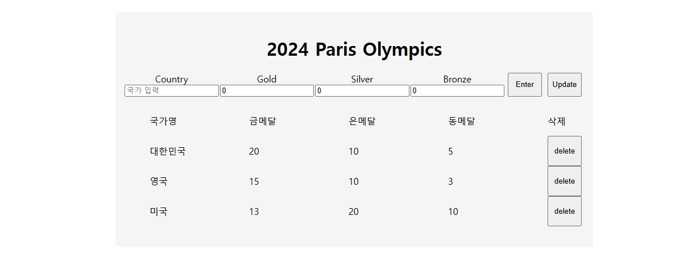

# 2024 파리 올림픽 메달 트래커 🥇🥈🥉

 

## 📅 프로젝트 기간
> 2025.01.21 - 2025.01.24

 

## 📝프로젝트 소개
> 각 국가의 메달 집계를 추적할 수 있는 React 기반의 웹 애플리케이션입니다.
CRUD 기능으로 국가와 메달 정보를 추가, 수정, 삭제할 수 있습니다.

 

## ⚙ 주요 기능
- **국가 추가**: 국가 이름과 메달 개수를 입력하여 리스트에 추가할 수 있습니다.
- **메달 개수 수정**: 기존 국가의 메달 정보를 업데이트할 수 있습니다.
- **국가 삭제**: 리스트에서 국가와 해당 정보를 삭제할 수 있습니다.
- **금메달 순위 정렬**: 국가들은 금메달 개수를 기준으로 내림차순으로 자동 정렬됩니다.

 

## 😀 기술 블로그
[리액트 왕초보가 Medal Tracker 만든 후기](https://debnjin.tistory.com/82)

 

## 💻 기술 스택

